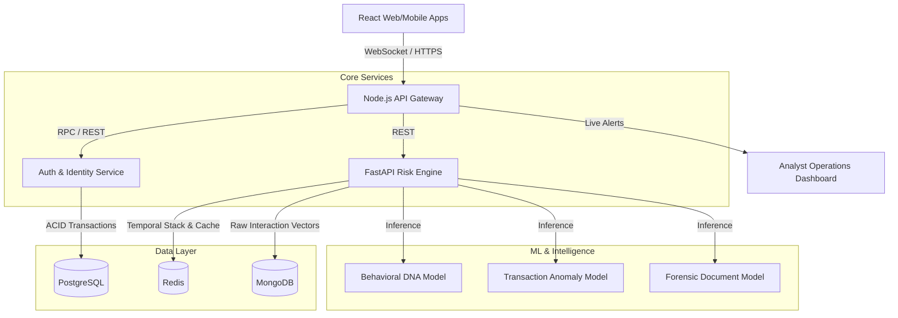

# Cogniq AI
## Real-Time Continuous Risk-Based Identity Trust Framework

Cogniq is an enterprise-grade continuous identity trust and real-time fraud prevention engine. It evaluates session risk and orchestrates adaptive security policies in under 12ms.

---

## Core Pillars

### 1. Behavioral DNA Engine
Compiles a passive, continuous behavioral fingerprint based on user interaction timing. Timing metadata is processed without storing any raw input strings or coordinates, ensuring a privacy-preserving design.
*   **Keystroke Dynamics:** Key dwell times and flight times.
*   **Mouse Trajectory:** Trajectory curvature, velocity, and tremor signatures on desktop web browsers.
*   **Swipe Characteristics:** Pressure profiles, swipe direction, and velocity vectors on mobile touch screens.
*   **Baseline Anomaly Detection:** Scored using an unsupervised Isolation Forest classifier trained on historical user-specific interaction patterns.

### 2. Device Trust Continuity
Every device accessing the platform is registered with a cryptographically secure, hashed hardware fingerprint.
*   **Trust Continuity Score:** An confidence level calculated from device age, network consistency, OS/browser parameters, and session frequency.
*   **Fingerprint Entropy:** Identifies device spoofing and emulator usage.

### 3. Contextual Risk Fusion Engine
Fuses multiple risk dimensions into a single decision score (0 - 100):
*   **Temporal Risk Stacking:** Uses a Redis-backed, time-decayed event queue that tracks compiling risk flags.
*   **Anti-Dilution Scaling:** Escalates transaction risks to a block if transaction anomaly subscores exceed critical thresholds.

### 4. Insider Threat Graph Modeling
Privileged access patterns are mapped using graph-based structural analysis.
*   **Normal Access Profile:** Clean star-graph structures indicating queries within a static, expected cluster of user accounts.
*   **Insider Threat Anomaly:** Star-to-web expansion patterns indicating a single employee accessing an atypical number of unrelated user accounts.

### 5. Document & Identity Forensics
Verifies identity documents during onboarding:
*   **Error Level Analysis:** Detects digital modifications by comparing compression artifacts.
*   **Noise Uniformity Analysis:** Flags anomalies in document structure.
*   **Bot Form-fill Audits:** Evaluates keystroke variability and field traversal timing to reject automated sign-ups.

---

## System Architecture



### Technical Stack
*   **API Gateway & Orchestration:** Node.js, Express, Socket.io
*   **Risk Evaluation Engine:** Python 3.10+, FastAPI, Uvicorn
*   **Machine Learning Models:** Scikit-learn, OpenCV
*   **Databases:**
    *   **PostgreSQL:** Relational user data, transactions, device registers, and risk events.
    *   **Redis:** Temporal risk stacking, session cache, and rate-limiting.
    *   **MongoDB:** Anonymized behavioral telemetry vectors.

---

## Database Schema Layout

### PostgreSQL
*   `users`: Stores credentials, employee status, role configurations, and baseline trust levels.
*   `devices`: Tracks registered fingerprints, continuity scores, and browser/OS signatures.
*   `risk_events`: Holds the immutable audit trail of every risk computation, output action, and contributing risk factors.
*   `transactions`: Records ledger entries, status flags (completed, blocked, pending verification), and risk scores.
*   `alerts`: Active operational alerts requiring analyst review.

---

## Getting Started

### Prerequisites
*   Docker & Docker Compose
*   Node.js (Bun runtime recommended)
*   Python 3.10+

### Step 1: Initialize Infrastructure Databases
```bash
docker compose up -d
```

### Step 2: Run Database Migrations & Seed Data
```bash
cd backend
bun install
bun run migrate
bun run seed
```

### Step 3: Run Services

**Terminal 1: Node.js API Gateway**
```bash
cd backend
bun run dev
```

**Terminal 2: FastAPI Risk Engine**
```bash
cd risk-engine
python -m venv venv
source venv/bin/activate
pip install -r requirements.txt
uvicorn app.main:app --reload --port 8000
```

**Terminal 3: React Frontend Web Portal**
```bash
cd frontend
bun install
bun run dev
```
